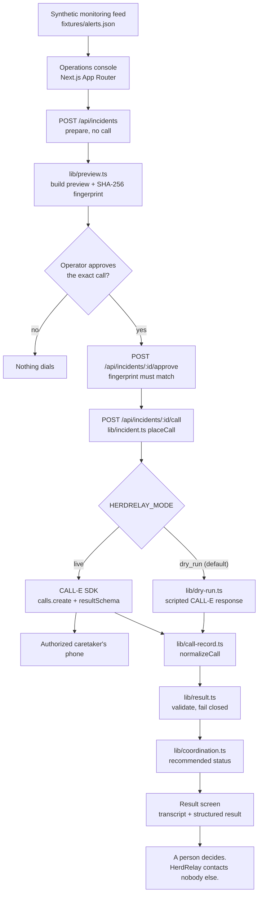

# HerdRelay

Human-approved livestock incident coordination. A barn monitoring system flags a possible
respiratory irregularity in one animal; HerdRelay turns that alert into **one** phone call to
**one** authorized caretaker, placed only after a person has approved the exact call, and returns
what the caretaker actually said as a validated structured result.

HerdRelay does not diagnose animals, does not give veterinary advice, and contacts nobody but the
caretaker the operator authorized. Every measurement it ships is synthetic.

- **Dry run is the default.** No credential is read and no phone rings until you deliberately
  switch modes.
- **Nothing dials without an approval** taken against a fingerprint of the exact call on screen.
- **Uncertainty survives.** An answer the caretaker did not give stays `null` or `"unknown"`, and a
  result that contradicts its own transcript is downgraded rather than believed.

---

## Problem statement

Automated livestock monitoring is good at noticing and bad at concluding. A camera or collar can
tell you that animal C-17's respiration has been running at 46 breaths per minute against a 25–35
baseline for eleven minutes. It cannot tell you whether she is ill, whether somebody is already
standing next to her, or whether the reading is an artifact of a feed push.

The gap between "a sensor is worried" and "a person has looked" is where herd health is actually
lost. Alerts pile into a dashboard nobody is watching at 05:40, or into a group chat where three
people each assume one of the others is going. Meanwhile the only fact that matters —
*is somebody going to walk to that pen, and when* — is unknown to everyone.

HerdRelay closes that gap without pretending to close the clinical one. It asks a person, by
phone, and it writes down the answer.

## Why phone calls are necessary

A caretaker on a dairy is not at a screen. They are in a parlour, on a quad, in a paddock with wet
gloves, or asleep. For this specific question:

- **A phone call interrupts; a notification does not.** The whole point of a high-severity alert is
  that it should reach somebody who is not looking for it.
- **The answer is conversational, not a tap.** "Can you go?" has answers like *"I'm forty minutes
  away at the feed merchant"* and *"give me twenty minutes, I want to finish this row"*. A push
  notification with Yes/No buttons turns both of those into a lie.
- **The answer needs a follow-up question.** "How soon?" only makes sense after "can you go?", and
  "is she in distress?" is worth asking only of somebody who can see her.
- **Voice confirms a human.** A tap can be a pocket. A person saying "yeah, I can head over there"
  cannot.

And phone calls have real-world consequences, which is why almost all of this codebase is about
*not* placing one carelessly.

## How HerdRelay works

1. **An alert arrives.** A synthetic monitoring feed produces an abnormal-respiration alert: animal,
   pen, timestamp, observed rate, expected range, confidence, severity, and an evidence summary.
2. **A person reviews it.** The alert-detail view shows the reading and says plainly what it is not:
   not a diagnosis, not a triage decision, not veterinary advice.
3. **HerdRelay prepares a call task.** The brief, the disclosure, the five questions and the result
   schema are all built server-side from the alert.
4. **The operator sees the complete masked preview**: masked recipient, purpose, the verbatim AI
   disclosure, the five questions word for word, the data expected back, the safety limitations, and
   the entire brief CALL-E will be given.
5. **The operator approves that exact call.** The approval carries a SHA-256 fingerprint of the
   preview. If anything about the call changes afterwards, the approval no longer redeems.
6. **CALL-E calls the authorized caretaker**, identifies itself as an AI-assisted livestock
   monitoring demonstration before asking anything, describes the reading as synthetic, and asks:
   1. Can you inspect the animal?
   2. How soon can you reach it?
   3. Are visible signs of distress present?
   4. Is veterinary or supervisor follow-up requested?
   5. Is there any additional observation?
7. **The console follows the call** through planned → approved → calling → in progress → completed,
   failed, unanswered or uncertain.
8. **The result is validated, then shown**: call summary, structured result, transcript evidence with
   timestamps, completion confidence, a recommended coordination status, and whether human review is
   required.
9. **A person decides what happens next.** HerdRelay never contacts a veterinarian, never books
   anything, never redials, and never schedules.

## Architecture



Both call paths converge on `normalizeCall()` before anything renders, so a dry run and a real call
go through one code path and a rehearsal cannot drift away from reality.

### Project layout

```text
apps/typescript/herdrelay/
├── app/
│   ├── api/                     Route handlers (server only; the browser never sends a number)
│   │   ├── state/               Mode, alerts, incidents
│   │   ├── incidents/           Prepare, read, approve, call, status, reconcile
│   │   └── demo/reset/          Resettable demo, refused in live mode
│   ├── components/              Console, alert table/detail, preview + approval gate, monitor, result
│   ├── globals.css              Operations-console theme
│   └── page.tsx
├── lib/
│   ├── access.ts                Operator auth and cross-origin rules (pure)
│   ├── alerts.ts                Alert fixtures loader; asserts `synthetic`
│   ├── alert-signal.ts          Pure alert readings, safe for the browser
│   ├── calle.ts                 CALL-E client, disclosure, brief, result schema
│   ├── call-record.ts           Provider response → one domain shape
│   ├── coordination.ts          Recommended status and incident phase
│   ├── dry-run.ts               Scripted no-call engine
│   ├── incident.ts              The workflow: prepare, approve, place, poll, reconcile
│   ├── mode.ts                  Dry run by default; live readiness
│   ├── operators.ts             Named operator accounts, scrypt-hashed
│   ├── phone.ts                 E.164, masking, reserved fictional range
│   ├── preview.ts               The approved object and its fingerprint
│   ├── redact.ts                Masking for logs and errors
│   ├── result.ts                Structured-result validation, fail closed
│   ├── self-service.ts          Consent, caps and per-number limits for a public demo
│   └── store.ts                 Incident files, locks, destination reservations
├── fixtures/                    Synthetic alerts and scripted CALL-E responses
├── render.yaml                  Deploy blueprint, safe defaults only
├── scripts/                     dry-run, preview-call, reset-demo, operators
├── tests/                       115 tests, no credentials, no calls
└── docs/keeping-uncertainty.md  Why an unclear answer must stay unclear
```

### State

One JSON file per incident under `data/` (gitignored), written temp-then-rename. No database and
nothing to stand up. Two safety properties live in the store rather than the UI, because a UI
guarantee is a guarantee against one browser tab:

- an **incident lock** serializes approve, place and poll for one incident;
- a **destination reservation**, keyed by a hash of the number, stops two incidents dialing the
  same caretaker.

The reservation is held only while an outcome is genuinely unknown — a call in flight, or a create
request that never came back. A call that finished, however badly, releases it: one caretaker usually
covers a whole farm, so a messy incident must never block every other animal. It is released by the
key stored when the reservation was taken rather than one re-derived from current configuration, so
editing the caretaker number mid-incident cannot strand it, and a reservation whose incident has
finished is treated as debris and taken over.

No incident file ever contains a phone number. `normalizeCall()` drops the recipient's number at the
provider boundary, and a test asserts it.

## CALL-E integration details

HerdRelay uses the official TypeScript SDK, [`@call-e/calle`](https://github.com/CALLE-AI/call-e-integrations),
server-side only. The API key is read from the environment inside a route handler and never reaches
the browser, a client component, or an incident file.

`lib/calle.ts` builds a client pinned to one origin:

```ts
new CalleClient({
  apiKey,
  baseUrl: "https://api.heycall-e.com",
  fetch: async (request) => {
    const url = new URL(request.url);
    if (url.origin !== CALLE_ORIGIN || url.username || url.password) {
      throw new Error("Unapproved CALL-E origin.");
    }
    return fetch(new Request(request, { redirect: "error", signal: AbortSignal.timeout(30_000) }));
  },
});
```

`CALLE_BASE_URL` is accepted for compatibility but only `https://api.heycall-e.com` passes, and
redirects are refused: a 302 would otherwise carry the API key somewhere else.

One call is created per incident:

```ts
await client.calls.create(
  {
    task: buildTask(alert, { siteName, caretakerName }),
    recipients: [{ phones: [phone], region, locale }],
    resultSchema: buildResultSchema(),
    metadata: { app: "herdrelay", incident_id: incident.id, alert_id: alert.id },
  },
  { idempotencyKey: `herdrelay:${incident.id}` },
);
```

Then `client.calls.get(callId)` polls, read-only. Every provider read is checked against the
incident before it is believed: the call ID, the status, the metadata, and the fact that there is
exactly one recipient whose number is the one that was approved.

### The result schema, and why it looks like that

The strict schema asks for seven fields, and **every field a person could leave unstated is an enum
with an explicit unclear/unknown member** rather than a boolean. `estimated_arrival_minutes` is a
string, not a number.

That is deliberate. A boolean has no way to say "they did not answer", so a boolean field forces the
model to invent one. Giving it a way to say nothing is what makes the validator able to keep the
uncertainty:

| Wire field (`result_schema`) | Values | Domain field |
| --- | --- | --- |
| `inspection_accepted` | `yes` / `no` / `unclear` | `inspectionAccepted: boolean \| null` |
| `estimated_arrival_minutes` | digits, or `unknown` | `estimatedArrivalMinutes: number \| null` |
| `visible_distress` | `yes` / `no` / `unknown` | `visibleDistress: "yes" \| "no" \| "unknown"` |
| `veterinary_followup_requested` | `yes` / `no` / `unclear` | `veterinaryFollowupRequested: boolean \| null` |
| `caretaker_notes` | free text, or `None given.` | `caretakerNotes: string \| null` |
| `outcome` | five-way enum | `outcome: CoordinationOutcome` |
| `human_review_required` | `yes` / `no` | `humanReviewRequired: boolean` |

`lib/result.ts` then validates. See [`docs/keeping-uncertainty.md`](docs/keeping-uncertainty.md) for
the full rule set; in short, an outcome that disagrees with its own fields or with the transcript is
downgraded to `uncertain` with human review required, and every change is printed on screen.

## Setup

Requires Node.js 22.9 or newer (`.nvmrc` pins 22).

```bash
cd apps/typescript/herdrelay
npm install
cp .env.example .env      # optional: the dry run runs without it
npm run dev               # http://localhost:3000
```

The dashboard runs in dry run with no configuration, no credentials, and no `.env` at all.

## Environment variables

| Variable | Required | Purpose |
| --- | --- | --- |
| `HERDRELAY_MODE` | no | `live` places real calls. **Anything else, including unset, is a dry run.** |
| `HERDRELAY_DRY_RUN_SCENARIO` | no | Default scripted outcome. Overridable per incident in the UI. |
| `HERDRELAY_AUTHORIZED_E164` | live only | The one number HerdRelay may dial, exact ASCII E.164. No default. Not used in self-service mode. |
| `HERDRELAY_CARETAKER_NAME` | live only | The person who agreed to receive these calls. Named on the call. Not used in self-service mode. |
| `HERDRELAY_SITE_NAME` | no | The farm named in the disclosure. Defaults to `Ridgeline Dairy`. |
| `CALLE_API_KEY` | live only | CALL-E credential. Server-side only; sent only to `api.heycall-e.com`. |
| `CALLE_BASE_URL` | no | Compatibility only; only `https://api.heycall-e.com` is accepted. |
| `HERDRELAY_AUTH_TOKEN` | fallback | Single shared login (`herdrelay` / this token), 32+ characters. Superseded by named accounts. |
| `HERDRELAY_OPERATORS_FILE` | no | Where operator accounts live. Defaults to `./operators.json`, which is gitignored. |
| `HERDRELAY_ORIGIN` | no | Exact browser origin. Unset uses the request's own `Host`, so any local port works. |
| `HERDRELAY_OPERATOR_SEED` | no | One account as `username:Display Name:password`, for a host with no shell. Plaintext; demo accounts only. |
| `HERDRELAY_SELF_SERVICE` | no | `true` lets the recipient supply and consent to their own number. Off otherwise. |
| `HERDRELAY_DAILY_CALL_CAP` | no | Calls a day across the deployment in self-service mode. Default 5. |
| `HERDRELAY_VISITOR_ATTEMPTS` | no | Attempts an hour per visitor in self-service mode. Default 3. |
| `HERDRELAY_DATA_DIR` | no | Where incident files go. Defaults to `./data`, which is gitignored. |

Live mode refuses to start a call unless **all** of the live-only variables are set, and unless there
is somebody to sign in as — either a named account or the shared token. `.env.example` carries no
real credential and no real number, and both `.env` and `operators.json` are gitignored.

## Operator accounts

An approval is the record that a **person** authorized a phone call, so it has to be able to say
which person. Create an account per operator:

```bash
npm run operators:add -- --username=marta --name="Marta Nowak"
npm run operators:list
```

The password is typed at a prompt, never echoed, never passed as an argument (which would put it in
shell history and in `ps`), and never stored — `operators.json` holds a scrypt hash and a per-account
salt, and is gitignored.

Sign in with that username and password, and the approval, the timeline and the incident record all
carry the name: *"Marta Nowak approved one simulated call to +1 ••••••••42."*

On a deployed host there is usually no shell to run `operators:add` in, and `operators.json` is
gitignored so it never travels with the code. For that case one account can be defined entirely by
an environment variable:

```
HERDRELAY_OPERATOR_SEED=judge:Devpost Judge:your-password-here
```

That is username `judge`, shown as "Devpost Judge", with the password after the second colon
(which may itself contain colons). Nothing is written to disk, so it works on a read-only
filesystem. The trade-off is real: this password sits in the deployment's environment in plaintext,
where a file account stores only a scrypt hash. Use it for a demonstration account whose password is
published anyway, not for an operator whose approval means something.

If no account exists, live mode falls back to `HERDRELAY_AUTH_TOKEN` — one shared password for the
whole deployment. That still gates the call, but the approval can only name the deployment, so the
console shows an amber warning saying exactly that. A deployment that has named accounts stops
accepting the shared token entirely.

Dry run needs neither, so a fresh clone runs with no credential at all.

## Local development

```bash
npm run dev            # dev server
npm run build          # production build
npm start              # serve the build
npm run typecheck      # tsc --noEmit
npm test               # node --test, no credentials, no calls
npm run check          # typecheck + tests
npm run demo:dry-run   # the whole workflow in the terminal
npm run demo:reset     # clear every incident, lock and reservation
npm run operators:add  # create a named operator account
npm run operators:list # list them
```

## Dry run

Dry run is the default. It plays a hand-authored CALL-E response through `normalizeCall()` — the
same boundary a live call crosses — so the console renders a rehearsal exactly the way it renders a
real call, and no request leaves the process.

Seven scenarios ship, selectable per incident in the UI or with `--scenario`:

| Scenario | What it exercises |
| --- | --- |
| `inspection_confirmed` | The clean path: accepted, ETA given, no review flagged |
| `followup_requested` | Distress reported, vet requested, escalation held for a human |
| `declined` | Caretaker cannot attend |
| `unanswered` | Nobody picked up; nothing established |
| `voicemail` | Machine answered; HerdRelay leaves no message |
| `contradictory` | Provider result disagrees with the transcript; fails closed to `uncertain` |
| `provider_failure` | The create request never comes back; calling halts, nothing retries |

In the terminal:

```bash
npm run demo:dry-run
npm run demo:dry-run -- --scenario=contradictory
npm run demo:dry-run -- --scenario=provider_failure --alert=alert_d22_0411
```

`scripts/dry-run.ts` approves its own call, so it **refuses to run** with `HERDRELAY_MODE=live`.

You can also print the exact call without placing it, in either mode:

```bash
npm run call:preview -- --alert=alert_c17_0412
```

## Real calls

**A real call rings a real person's phone and cannot be un-placed.** Only do this with a caretaker
who has agreed, in advance, to receive AI-assisted monitoring calls at that number.

1. Get a CALL-E API key and set `CALLE_API_KEY`.
2. Set `HERDRELAY_AUTHORIZED_E164` to the caretaker's number in exact E.164 (`+14155552671`).
   Reserved fictional numbers are rejected: they are for the dry run only.
3. Set `HERDRELAY_CARETAKER_NAME`, and `HERDRELAY_SITE_NAME` for your farm.
4. Create an operator account so approvals name a person — live mode is never open:
   ```bash
   npm run operators:add -- --username=marta --name="Marta Nowak"
   ```
   (Or set `HERDRELAY_AUTH_TOKEN` to 32+ random characters for a single shared login instead.)
5. Set `HERDRELAY_MODE=live` and restart.

In the console the badge turns red, the authorize control turns red, names the masked destination,
and stays disabled until you type `AUTHORIZE`.

From the terminal, the same call with the same gates:

```bash
npm run call:authorize -- --alert=alert_c17_0412
```

If the create request fails, what happens depends on what failed. A request CALL-E *refused* — a bad
key, an exhausted balance, a rate limit, a malformed body — never reached a carrier, so the incident
fails cleanly, the caretaker is freed, and the reason is shown and logged. A timeout or a dropped
connection is genuinely unknown, so HerdRelay **does not retry**, even with an idempotency key: the
incident halts, the caretaker stays reserved, and you reconcile it against the CALL-E dashboard
before anything else happens. Anything HerdRelay does not recognise is treated as unknown.

## Self-service demo mode

Off unless `HERDRELAY_SELF_SERVICE=true`. Normally HerdRelay dials one number
configured on the server, which is the right shape for a farm: the caretaker agreed in advance and
the browser can never steer the call elsewhere.

A public demonstration needs the opposite — the person trying it wants their *own* phone to ring.
That is a genuinely more dangerous shape, because a public page that dials a number a stranger typed
is an open dialer. Self-service mode is that shape, bounded:

| Lock | What it does |
| --- | --- |
| **Consent statement** | The number arrives with an explicit "this is my own phone and I agree to receive one automated AI call". Nothing is prepared, reserved or dialed without it, and the statement is stored on the incident with a timestamp. |
| **One call per number, ever** | A number this deployment has rung can never be rung again. Checked when the number is offered *and* again immediately before dialing, because two incidents can be prepared before either dials. |
| **Daily cap** | At most `HERDRELAY_DAILY_CALL_CAP` calls a day across everybody, default 5. An unusable value falls back to the default rather than to no cap. |
| **Per-visitor attempts** | At most `HERDRELAY_VISITOR_ATTEMPTS` attempts an hour from one visitor, default 3, counted before the other checks so a refused attempt still costs the visitor. |
| **Sign-in still required** | The console is not open. Use a named account, or a shared password published alongside the demo. |
| **The number stays off the record** | It is written to a separate file, never into the incident, and erased when the call ends. The result, transcript and record all read fine without it. |

The budgets are spent when the provider *accepts* the call, not when it completes: a call that
connected and then failed has still rung that phone once.

None of this makes an open dialer safe. It makes a supervised demonstration bounded, and it is not
something to leave running unattended. For an unattended public URL, run dry run instead — it needs
no credentials, rings nothing, and demonstrates the same workflow through the same code path.

## Safety and consent

| Protection | Where it lives |
| --- | --- |
| Dry run is anything that is not exactly `live` | `lib/mode.ts` |
| The browser can never supply a destination | Routes accept an `alertId`, never a number |
| Only one configured number is dialable; no hard-coded fallback | `lib/preview.ts`, `lib/mode.ts` |
| Reserved fictional numbers are refused as live destinations | `lib/phone.ts` |
| Approval is bound to a SHA-256 fingerprint of the exact call | `lib/preview.ts`, `lib/incident.ts` |
| The call mode is part of the fingerprint, so a dry-run approval cannot redeem for a real call | `lib/preview.ts` |
| Approvals expire after 10 minutes | `lib/incident.ts` |
| A live authorize requires typing `AUTHORIZE` | `app/components/CallPreviewPanel.tsx` |
| One call per incident; a second start returns the first call | `lib/incident.ts` |
| A finished incident can be attempted again; only an unresolved one blocks | `lib/store.ts` |
| One in-flight call per caretaker, held while the outcome is unknown | `lib/store.ts` |
| A finished call frees the caretaker, so the next animal is never blocked | `lib/store.ts`, `lib/incident.ts` |
| A blocked call names the incident holding the caretaker, and links to it | `lib/store.ts`, `app/components/Console.tsx` |
| An unknown create outcome halts and never retries | `lib/incident.ts` |
| A request the provider refused fails cleanly and frees the caretaker, because no phone rang | `lib/calle.ts` |
| Only the provider itself can establish that no call was placed; anything unrecognised is unknown | `lib/calle.ts` |
| Numbers are masked in the UI, in incident files, and in logs | `lib/phone.ts`, `lib/redact.ts` |
| Provider errors are redacted before they reach a response | `lib/incident.ts` |
| The caller says it is an AI before asking anything | `lib/calle.ts` |
| The brief refuses diagnosis, treatment, escalation and promises | `lib/calle.ts` |
| Unclear answers stay unclear; contradictions fail closed | `lib/result.ts` |
| Live mode requires a signed-in operator | `lib/access.ts` |
| Caller-supplied numbers are refused outright unless self-service mode is on | `lib/self-service.ts` |
| A self-service call needs a recorded consent statement from the recipient | `lib/self-service.ts` |
| One call per number ever, checked again at the moment of dialing | `lib/self-service.ts`, `lib/incident.ts` |
| Daily and per-visitor caps bound how much a public demo can be abused | `lib/self-service.ts` |
| Approvals record the name of the person who made them | `lib/operators.ts`, `lib/incident.ts` |
| Passwords are scrypt-hashed with a per-account salt, never stored or recoverable | `lib/operators.ts` |
| A wrong password and an unknown account are indistinguishable | `lib/access.ts`, `lib/operators.ts` |
| A misconfigured caretaker number is reported as advice, never echoed back | `lib/phone.ts` |
| Cross-origin state changes are refused | `lib/access.ts` |
| Reset is refused in live mode | `app/api/demo/reset/route.ts` |

**What HerdRelay will not do**, in code and not only in prose: diagnose an animal, offer a clinical
opinion, contact a veterinarian, contact an emergency service, buy anything, schedule anything,
redial, or make any decision that follows from the call. The only thing it produces is a record of
what one person said.

## Testing

```bash
npm test        # 115 tests
npm run check   # typecheck + tests
```

No test needs a credential, a network, or a phone. The suite covers E.164 handling and masking,
redaction of anything number-shaped, the CALL-E brief and result schema, origin pinning, operator
accounts and password hashing, mode defaults and live-readiness including a misconfigured
destination, the approval fingerprint, the dry-run engine's refusal to reveal
terminal data early, result validation including every contradiction rule, coordination status and
phase derivation, and the workflow end to end: approval gate, approval attribution,
duplicate protection, the per-caretaker reservation and its release, halt-on-unknown, and
reconciliation.

The end-to-end tests fast-forward the simulated clock rather than sleeping, so the suite runs in
about 1.5 seconds.

## Deployment

`render.yaml` is a ready blueprint for [Render](https://render.com), and its build and start commands
work unchanged on Railway, Fly.io, or any host running Node 22 with a normal filesystem. Every value
in it is the safe default: no-call mode, no caller-supplied numbers, no credential. Point Render at
this repository, and it builds from `apps/typescript/herdrelay`.

Then set in the dashboard, never in the file:

| Variable | Value |
| --- | --- |
| `HERDRELAY_OPERATOR_SEED` | `judge:Devpost Judge:your-password` — the sign-in you publish |
| `HERDRELAY_ORIGIN` | your exact `https://…` URL |

That is a complete no-call demo: judges sign in, walk the whole workflow, and no phone can ring.

To let a visitor have their own phone called, additionally set `HERDRELAY_MODE=live`,
`HERDRELAY_SELF_SERVICE=true` and `CALLE_API_KEY`, and read the self-service section above first.
Turn it off after judging.

A note on hosts: HerdRelay keeps incident state as files, so it needs a single always-on instance.
Serverless platforms with per-invocation filesystems — Vercel among them — will lose an incident
between the request that created it and the request that polls it, and will not enforce the
cross-process locks. On Render's free plan the filesystem resets when the instance restarts, which
costs nothing here because the demo has a reset button; attach a disk and point `HERDRELAY_DATA_DIR`
at it if records need to survive.

It is a single-operator tool, so:

- set `HERDRELAY_AUTH_TOKEN` and, behind a proxy or CDN, `HERDRELAY_ORIGIN` to your exact HTTPS
  origin;
- point `HERDRELAY_DATA_DIR` at a persistent disk — incident files are the record that a call
  happened;
- keep `HERDRELAY_MODE` unset until the deployment is verified. A live deployment with a
  misconfigured destination is a stranger's phone ringing at 05:40.

Serverless platforms with ephemeral filesystems will lose incident state between invocations and
will not enforce the cross-process locks; use a host with a real disk, or replace `lib/store.ts`.

## Demo walkthrough

1. `npm run dev`, open `http://localhost:3000`. The badge reads **DRY RUN**.
2. The alerts table shows four synthetic alerts. A-09 reads "No call warranted" — 33 breaths/min
   inside a 25–35 range at 41% confidence is not worth ringing anybody about, and HerdRelay says so.
3. Click **C-17**: 46 breaths/min against 25–35, 91% confidence, high severity, with the evidence
   summary and a panel stating what the alert is not.
4. Pick a dry-run scenario and click **Prepare call task**. Nothing dials.
5. Read the preview: masked recipient, purpose, the verbatim AI disclosure, the five questions, the
   data expected back, the safety limitations, and the whole brief behind a disclosure triangle.
6. Tick the acknowledgement, click **Approve this call**. Step 2 unlocks — a separate block, a
   separate action.
7. Click **Start simulated call**. Watch planned → approved → calling → in progress → completed, with
   the transcript arriving in timestamped turns.
8. Read the result: coordination status, the seven structured fields with unstated answers in amber
   rather than red, the transcript evidence, completion confidence, and the timeline.
9. Re-run with `contradictory`: the provider claims `inspection_confirmed`, the transcript shows a
   caretaker who would not commit, and HerdRelay reports **uncertain** with every correction listed.
10. Re-run with `provider_failure`: calling halts, the caretaker stays reserved, and nothing retries.
11. **Reset demo** clears everything.

## Known limitations

- **The monitoring feed is synthetic.** There is no camera, collar, or IoT integration, and no code
  path that ingests real animal data. The alerts are fixtures and are labelled as such everywhere.
- **One caretaker.** The live path dials exactly one configured number. There is no rota, no
  escalation ladder, and no second attempt if nobody answers — deliberately, since an escalation
  ladder that dials on its own is a category of side effect this demo does not want.
- **Local disk state.** `lib/store.ts` assumes one host with a real filesystem. Two hosts sharing
  nothing would not share the locks either.
- **Polling, not webhooks.** CALL-E terminal webhooks are not wired up; the console polls. That is
  fine at demo scale and wasteful at farm scale.
- **English only.** The brief instructs the caller to speak English throughout.
- **The validator cannot rescue a bad transcript.** It can catch a result that disagrees with the
  transcript; it cannot catch a transcript that misheard the caretaker.
- **Authentication is local accounts, not the farm's identity.** Operators sign in against a JSON
  file this app owns. There is no SSO, no password reset, no lockout after repeated failures, no
  session expiry, and no second factor. A real deployment should sit behind the farm's existing
  Google Workspace or Microsoft identity so that leavers lose access when they leave, rather than
  when somebody remembers to edit a file. What is here gets the audit trail right — an approval
  names a person — without needing a registered OAuth application to run from a fresh clone.
- **No integration with herd records.** Nothing is written back to any farm system, on purpose.

## Future work

- SSO against the farm's existing identity provider, replacing local accounts, so access follows
  employment and the approval record carries a verified identity.
- A caretaker rota with an escalation ladder, gated behind a per-rung approval rather than a timer.
- CALL-E terminal webhooks with signature verification, replacing the poll.
- Callback-window awareness, so a moderate-severity alert at 02:00 waits for a reasonable hour while
  a high-severity one does not.
- Multilingual briefs, with the caretaker's language on their record rather than on the site.
- A recorded-outcome ledger so a week of alerts can be reviewed against what the calls established.
- A real sensor adapter behind an explicit boundary, keeping `synthetic` honest for everything else.

---

## Three-minute demo video script

**0:00–0:20 — The problem.**
"At 5:40 in the morning, a barn camera notices that cow C-17 is breathing at 46 breaths a minute,
against a normal range of 25 to 35. That's all it knows. It can't tell you if she's ill, and it
can't tell you whether anyone is going to walk to Pen 4. This is HerdRelay. It doesn't try to
diagnose the cow. It gets a person on the phone and writes down what they say."

**0:20–0:40 — The console.**
Show the dashboard. "Four synthetic alerts. Notice A-09: 33 breaths a minute, inside range, 41
percent confidence. HerdRelay says no call is warranted — the cheapest phone call is the one you
don't make. C-17 is the one that matters."

**0:40–1:05 — The alert.**
Click C-17. "The reading, the range, the confidence, the evidence. And a panel saying what this is
*not*: not a diagnosis, not triage, not veterinary advice. Every figure here is synthetic and the
app says so."

**1:05–1:45 — The gate.**
Click Prepare call task. "Before anything dials, here is the entire call. The recipient, masked.
The purpose. The disclosure that gets spoken word for word — it says it's an AI, it says the data is
synthetic, it says nothing it says is a diagnosis. The five questions. What we expect back. The
limits. And the whole brief. This whole object is hashed, and the approval is bound to that hash: if
anything about this call changes, the approval stops working." Tick, approve. "Approving and calling
are two different actions, in two different blocks. In live mode the second one is red and you have
to type AUTHORIZE."

**1:45–2:20 — The call.**
Click Start simulated call. "Dry run is the default. This is a scripted CALL-E response going
through exactly the same code path a real call uses." Show the status strip and the transcript
filling in. "Planned, approved, calling, in progress. And the transcript: the caretaker says he can
go in about twenty minutes, and that he can't judge distress because he hasn't seen her yet."

**2:20–2:45 — The result.**
"Structured result. Inspection accepted: yes. Arrival: twenty minutes. Visible distress: unknown —
in amber, not 'no' in red, because those are different facts and the difference decides whether
somebody drives to the barn. Coordination status: caretaker inspecting."

**2:45–3:00 — Failing closed.**
Switch to the `contradictory` scenario. "Here CALL-E returns 'inspection confirmed' — but the
transcript shows a caretaker who wouldn't commit. HerdRelay downgrades it to uncertain, flags human
review, and prints every correction it made. It fails closed, it never contacts a vet, and it makes
no decision at all. A person does."

## Suggested Devpost description

> **HerdRelay — human-approved livestock incident coordination by phone**
>
> Automated herd monitoring is good at noticing and bad at concluding. A camera can tell you cow
> C-17 has been breathing at 46 breaths a minute against a 25–35 baseline for eleven minutes. It
> cannot tell you whether anyone is going to walk to Pen 4.
>
> HerdRelay turns that alert into one CALL-E phone call to one authorized caretaker — placed only
> after a person approves the exact call, disclosure and questions included — and returns what the
> caretaker actually said as a validated structured result: can you inspect her, how soon, is there
> visible distress, do you want a vet, anything else.
>
> It refuses to do the interesting-sounding parts. It does not diagnose the animal, does not give
> veterinary advice, never contacts a vet or an emergency service on its own, never redials, and
> never schedules. The call collects observations; a human decides.
>
> The engineering is mostly in not calling carelessly. Dry run is the default and is the value of
> anything that is not exactly `live`. The approval is bound to a SHA-256 fingerprint of the exact
> call on screen, so an approval cannot be spent on a call that changed. The browser can never supply
> a phone number. One in-flight call per caretaker is enforced on disk, and a create request whose
> outcome is unknown halts the incident instead of retrying. Numbers are masked in the UI, in stored
> records and in logs.
>
> And uncertainty survives: the CALL-E result schema gives every human-answerable field a way to say
> "they didn't say", and the validator downgrades any outcome that contradicts its own fields or the
> transcript to `uncertain` with human review required — printing every correction it made.
>
> TypeScript, Next.js, the official CALL-E SDK server-side, 70 tests that need no credentials and
> place no calls.

## Suggested pull request

**Title**

```text
feat(apps): add herdrelay, human-approved livestock incident coordination
```

**Description**

```markdown
HerdRelay turns a synthetic livestock respiratory alert into one human-approved CALL-E call to one
authorized caretaker, and returns what that caretaker said as a validated structured result.

The workflow is alert → masked preview → explicit approval → one call → validated result → a human
decision. The app diagnoses nothing, gives no veterinary advice, contacts nobody but the approved
caretaker, never redials and never schedules.

Safety is enforced in code rather than prose:

- dry run is the value of anything that is not exactly `HERDRELAY_MODE=live`, and ships as the default
- the approval is bound to a SHA-256 fingerprint of the exact preview, mode included, and expires
- the browser never supplies a destination; only one configured E.164 number is dialable and
  reserved fictional numbers are refused for live calls
- one call per incident and one in-flight call per caretaker, enforced with on-disk locks and
  reservations
- a create request with an unknown outcome halts the incident and never retries
- phone numbers are masked in the UI, in stored incident records and in logs
- the result validator keeps unclear answers unclear and downgrades contradictions to `uncertain`
  with human review required, printing every correction

CALL-E is integrated at runtime through the official TypeScript SDK, server-side only, with the
credential pinned to `https://api.heycall-e.com` and redirects refused. Seven dry-run scenarios
cover confirmation, escalation, decline, no answer, voicemail, a contradictory provider result and a
provider failure.

Tests: 115, no credentials and no calls.
```

---

HerdRelay is a demonstration of a human-approved phone-call workflow. It is not a veterinary product.
